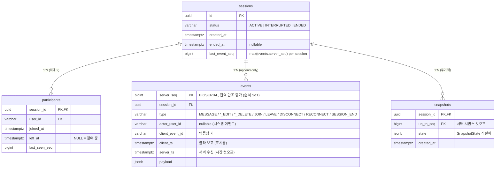

# DB 설계

## ERD

## 테이블별 결정 근거

### `events` — SoT
| 결정 | 근거 |
|---|---|
| PK = `server_seq BIGSERIAL` | 순서 판정 SoT. 클라 시계/네트워크 지연 무관 결정적. |
| `UNIQUE (session_id, client_event_id)` | 멱등 SoT. `INSERT … ON CONFLICT DO NOTHING`. 세션 단위 unique로 클라 부담 ↓. |
| `payload JSONB` | 타입별 필드 다름. 정규화하면 테이블 폭발 → 스키마 진화 자유도 ↑, 검증은 application. |
| `server_ts` 별도 보관 | `at=<ts>` 시점 복원에 필수. seq만으론 시간 매핑 불가. |
| `client_ts` 보관 | 오프라인 작성 메시지 원본 시각 보존. 순서 결정엔 미사용. |

### `sessions` — 프로젝션
| 결정 | 근거 |
|---|---|
| `id UUID` | 분산 환경 ID 충돌 회피 + URL enumeration 방어. |
| `last_event_seq` 캐시 | `MAX(events.server_seq)` 매번 계산 회피 + catch-up 워터마크. |
| events에서 재구축 가능 | 정합성 깨져도 events로 완전 복구. |

### `participants` — 프로젝션
| 결정 | 근거 |
|---|---|
| PK = `(session_id, user_id)` | 중복 행 차단 + `ON CONFLICT` 멱등 join의 기반. |
| `left_at` nullable | 별도 enum 없이 "참여 여부 + 떠난 시각" 동시 표현. |
| `last_seen_seq` | 재연결 catch-up 시작점 + unread 계산 단일 컬럼. |

### `snapshots` — 성능 최적화
| 결정 | 근거 |
|---|---|
| PK = `(session_id, up_to_seq)` | 한 세션에 여러 snapshot 보관 → `at` 기준 적절한 base 선택. |
| `state JSONB` | 도메인 진화 시 `version` 필드 추가로 점진적 마이그레이션 가능. |
| `idx_snapshots_session_seq_desc` | "seq N 이하 최신 snapshot" 인덱스 only scan 1회. |

## 인덱스

| 인덱스 | 목적 | 비용/효용 |
|---|---|---|
| `idx_sessions_status_created_at` | 세션 목록 (status + 최신순) | 세션 수 ≪ 이벤트 수 → 쓰기 부담 미미 |
| `idx_participants_user_active` (partial) | 유저의 활성 세션 조회 | partial이라 활성 행만 인덱싱 → 크기 최소 |
| `uq_events_session_client_event_id` UNIQUE | 멱등 dedup | UNIQUE 강제 + 조회 인덱스 겸용 |
| `idx_events_session_seq` | 타임라인 리플레이 | hot path, 인덱스 only scan 가능 |
| `idx_events_session_server_ts` | 시간 컷오프 (`at=<ts>` 복원) | seq 인덱스로 대체 불가 |
| `idx_events_session_type_seq` | 타입별 부분 조회 (예: 최근 메시지) | 풀 스캔 + 필터보다 저렴 |
| `idx_snapshots_session_seq_desc` | 특정 seq 이하 최신 snapshot | DESC 인덱스로 단건 조회 |

### 트레이드오프
- **이벤트 인덱스 4개** = INSERT당 4개 인덱스 업데이트(~1.3~1.5× 비용). 채팅은 읽기:쓰기 = 10:1 이상이라 손익 분기 통과.
- **`payload` GIN 인덱스 미설치**: hot path 아님. 필요 시 `CREATE INDEX ... USING GIN (payload)` 추가.
- **partial index 활용**: `WHERE left_at IS NULL`처럼 조건부로 인덱스 크기 절감.

## 정규화 정책

- 정규화 유지: sessions / participants / events / snapshots는 책임이 명확히 분리됨.
- 비정규화 캐시: `sessions.last_event_seq`, `participants.last_seen_seq` — 둘 다 events에서 재계산 가능 → 정합성 깨져도 복구 가능.
- JSONB: `events.payload`, `snapshots.state` — 도메인 진화 우선.

## ORM 정책 (jOOQ)

- 컴파일 타임 컬럼/타입 안전 + SQL DSL → ON CONFLICT/GREATEST/JSONB 모두 1급.
- 스키마는 Flyway가 SoT, jOOQ는 라이브 Postgres를 introspect해서 매번 codegen → drift 0.
- 코드 생성물은 `build/generated-sources/jooq/`, 커밋하지 않음 (스키마 변경 즉시 자동 재생성).
